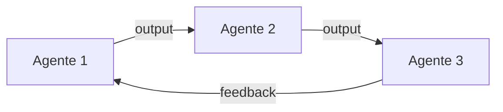

# Multi-Agent Workflow — {NOME_DO_WORKFLOW}

> **Versão:** 1.0.0
> **Data:** {DD/MM/AAAA}
> **Padrão:** Sequential | Fan-Out | Orchestrator-Worker | Hierarchical | Event-Driven
> **Descoberta Interativa:** Realizada em {DD/MM/AAAA}

---

## 🧭 Resumo da Descoberta

| Pergunta | Resposta |
|---|---|
| Problema que o workflow resolve | {resposta} |
| Quantos agentes necessários | {número} |
| Equipes envolvidas | {equipes} |
| Comunicação atual | {como se comunicam} |
| Restrições de coordenação | {limitações} |

---

## Seleção do Padrão

<!-- PREENCHA: justifique por que este padrão foi escolhido -->

| Padrão | Por que (sim) | Por que não (os outros) |
|---|---|---|
| **Sequential** | {justificativa se aplicável} | — |
| **Fan-Out** | {justificativa se aplicável} | — |
| **Orchestrator-Worker** | {justificativa se aplicável} | — |
| **Hierarchical** | {justificativa se aplicável} | — |
| **Event-Driven** | {justificativa se aplicável} | — |

---

## Agentes

### Agente 1: `{nome}`
- **Role:** {ex: Product Manager}
- **Responsabilidade:** {o que faz}
- **Input:** {de onde recebe dados}
- **Output:** {para quem entrega}
- **Sensor de Validação:** {como verifica seu output}

### Agente 2: `{nome}`
- **Role:** {ex: Developer}
- **Responsabilidade:** {o que faz}
- **Input:** {de onde recebe dados}
- **Output:** {para quem entrega}
- **Sensor de Validação:** {como verifica seu output}

### Agente 3: `{nome}`
- **Role:** {ex: QA}
- **Responsabilidade:** {o que faz}
- **Input:** {de onde recebe dados}
- **Output:** {para quem entrega}
- **Sensor de Validação:** {como verifica seu output}

---

## Protocolo de Comunicação

| De | Para | Formato | Canal |
|---|---|---|---|
| {Agente 1} | {Agente 2} | {JSON | Texto | Spec} | {Fila | API | Arquivo} |
| {Agente 2} | {Agente 3} | {formato} | {canal} |

---

## Diagrama do Fluxo

<!-- PREENCHA: diagrama real do seu workflow -->

---

## Gerenciamento de Estado

| Estado | Onde é armazenado | Quem acessa |
|---|---|---|
| Spec | `specs/` | Todos os agentes |
| Código gerado | `src/` | Developer + QA |
| Test results | `test-results/` | QA + Orchestrator |
| Decisões | `decisions.md` | Todos os agentes |

---

## Tratamento de Erros

| Erro | Quem detecta | Ação | Retry? |
|---|---|---|---|
| Spec ambígua | Developer | Solicita clarificação | Sim (max 2x) |
| Test falha | QA | Retorna ao Developer | Sim (max 3x) |
| Build falha | Sensor CI | Retorna ao Developer | Sim (max 3x) |
| Timeout | Orchestrator | Escala para humano | Não |

---

## Monitoramento

| Métrica | Target | Alerta |
|---|---|---|
| Tempo por agente | {ex: 5min} | {ex: 10min} |
| Taxa de sucesso | {ex: 95%} | {ex: 80%} |
| Retries por ciclo | {ex: 1} | {ex: 3} |
