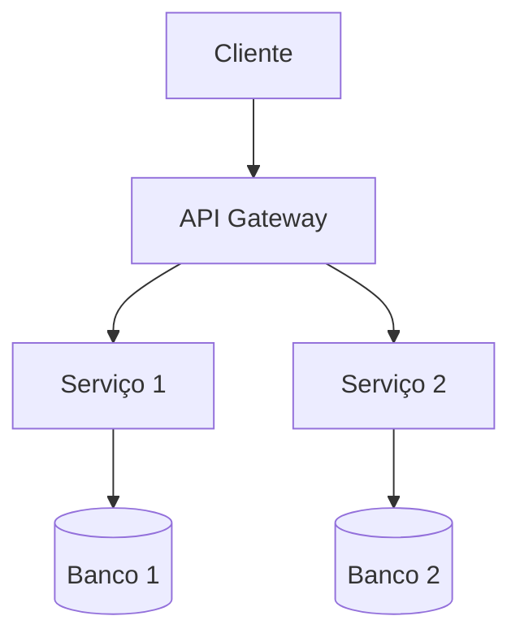

# Design Arquitetural — {NOME_DA_FEATURE}

> **Spec:** `.kiro/specs/{feature}/design.md`  
> **Data:** {DD/MM/AAAA}  
> **Status:** Rascunho | Aprovado

---

## Visão Geral

Descreva a arquitetura da solução em 2-3 parágrafos.

<!-- PREENCHA: visão geral da arquitetura -->

---

## Diagrama de Arquitetura



<!-- PREENCHA: diagrama real da sua arquitetura -->

---

## Decisões Tecnológicas

<!-- GUIA: Para cada componente, pergunte-se:
- Esta tecnologia resolve o problema definido na descoberta?
- Qual o trade-off vs. a alternativa mais óbvia?
- A equipe tem expertise nesta tecnologia?
- O custo de operação é sustentável? -->

| Componente | Tecnologia | Justificativa | Alternativas Rejeitadas |
|---|---|---|---|
| Backend | {ex: Node.js + Express} | {justificativa} | {ex: Python/FastAPI — motivo} |
| Banco de Dados | {ex: PostgreSQL} | {justificativa} | {ex: MongoDB — motivo} |
| Cache | {ex: Redis} | {justificativa} | {ex: Memcached — motivo} |

---

## Modelo de Dados

### Entidade: {Nome}

| Campo | Tipo | Obrigatório | Descrição |
|---|---|---|---|
| id | UUID | Sim | Identificador único |
| {campo} | {tipo} | {sim/não} | {descrição} |

---

## Contratos de API

### `POST /api/{recurso}`

**Request:**
```json
{
  "campo1": "valor",
  "campo2": 123
}
```

**Response 201:**
```json
{
  "id": "uuid",
  "campo1": "valor",
  "created_at": "2026-04-15T00:00:00Z"
}
```

---

## Segurança

- **Autenticação:** {JWT, OAuth2, API Key}
- **Autorização:** {RBAC, ABAC}
- **Criptografia:** {em trânsito, em repouso}
- **Rate Limiting:** {configuração}

---

## Trade-offs

| Decisão | Prós | Contras | Mitigação |
|---|---|---|---|
| {Decisão} | {pró} | {contra} | {mitigação} |
